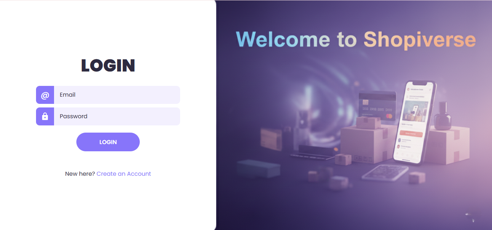

# 🛒 Shopiverse – E‑Commerce Website

**Shopiverse** is a modern and user-friendly e‑commerce website designed to deliver a smooth online shopping experience. The project focuses on clean UI design, intuitive navigation, and essential e‑commerce features such as product browsing, cart management, and user authentication pages.

🔗 **Live Website:** https://shopiverse-ecom.netlify.app/

---

## 📌 Project Overview

Shopiverse is built as a frontend-focused e‑commerce platform showcasing electronic gadgets like laptops, smartphones, headphones, and wearables. The website includes multiple well-structured pages such as Home, Products, Cart, Login, Signup, About, and Contact, providing a complete shopping flow similar to real-world e‑commerce applications.

The UI emphasizes clarity, responsiveness, and accessibility, making it easy for users to explore products, manage quantities, and navigate between pages seamlessly.

---

## ✨ Features

- Modern and responsive UI design  
- Product listing with categories and pricing  
- Add to cart functionality with quantity control  
- Cart page with remove option  
- Login and Signup pages (UI-based authentication flow)  
- Contact page with form and embedded Google Map  
- About / Why Choose Shopiverse section  
- Smooth navigation across pages  

---

## 🛠️ Technologies Used

- **HTML5** – Page structure and content  
- **CSS3** – Styling, layout, responsiveness, and animations  
- **JavaScript** – Interactivity, cart logic, and UI behavior  
- **Netlify** – Deployment and hosting  

---

## 🖼️ Screenshots

### Home Page


### Products Page


### Cart Page


### Login Page


### Signup Page


### About Section


### Contact Page


---

## 📂 Project Structure

```
Shopiverse/
├── index.html
├── products.html
├── cart.html
├── login.html
├── signup.html
├── about.html
├── contact.html
├── css/
├── js/
├── images/
└── README.md
```

---

## 🚀 Getting Started

1. Clone the repository:
   ```bash
   git clone https://github.com/your-username/shopiverse.git
   ```
2. Open `index.html` in your browser  
   **OR**  
   Visit the live site: https://shopiverse-ecom.netlify.app/

---

## 🎯 Learning Outcomes

- Building multi-page websites  
- Designing real-world e‑commerce UI  
- Managing cart logic with JavaScript  
- Structuring scalable frontend projects  
- Deploying projects using Netlify  

---

## 📜 License

This project is created for learning and educational purposes.

---

### 👤 Author
**Aqib Shekh**

If you like this project, feel free to ⭐ the repository!
